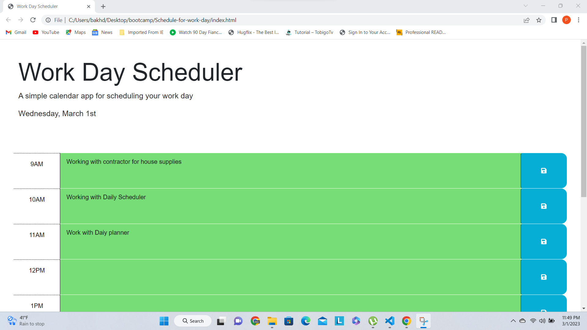
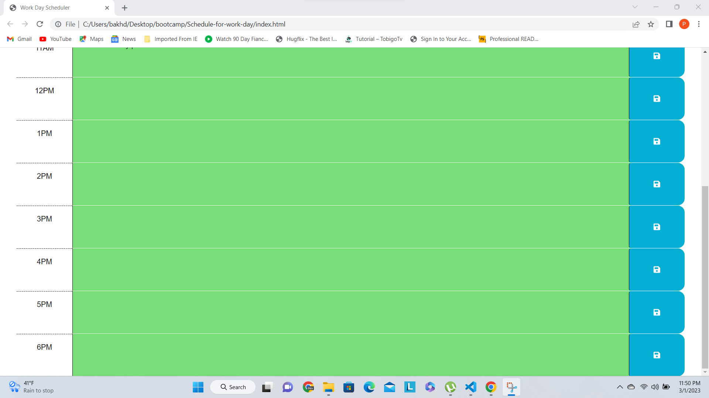

# Schedule-for-work-day
A schedule for days worked

## Description

Provide a short description explaining the what, why, and how of your project. Use the following questions as a guide:

- What was your motivation? My Motivation was to build a presentable and working work scheduler to enhance daily functions and help memorize and keep track of certain tasks and events.
- Why did you build this project? I built this project to challenge myself and understand how to utilize different elements and how to incorporate them. 
- What problem does it solve? Problem it solves is it displays a working and stable Work Scheduler to make tasks more memorable and and easy to remember.
- What did you learn? I learned different HTML CSS and Java Script styling elements and how to use them but also learned how use different variables.

## Installation

What are the steps required to install your project? Provide a step-by-step description of how to get the development environment running. First I had to improve starter code and make sure everything functioned properly and worked smoothly, Then I had to write java script code and had to check if worked properly with the html and css code,  I also had to write the readme file and fill it out.

## Usage

Provide instructions and examples for use. Include screenshots as needed.

To add a screenshot, create an `assets/images` folder in your repository and upload your screenshot to it. Then, using the relative filepath, add it to your README using the following syntax:

    ```md
    
    
    ```

## Credits

List your collaborators, 
https://www.w3schools.com/html/html_css.asp
https://www.w3schools.com/html/html_scripts.asp
https://www.w3schools.com/css/css_dimension.asp
https://www.w3schools.com/js/js_variables.asp
https://www.w3schools.com/js/js_const.asp
https://www.w3schools.com/js/js_arrays.asp

## License

The last section of a high-quality README file is the license. This lets other developers know what they can and cannot do with your project. If you need help choosing a license, refer to [https://choosealicense.com/](https://choosealicense.com/).

---

🏆 The previous sections are the bare minimum, and your project will ultimately determine the content of this document. You might also want to consider adding the following sections.

## Badges


Badges aren't necessary, per se, but they demonstrate street cred. Badges let other developers know that you know what you're doing. Check out the badges hosted by [shields.io](https://shields.io/). You may not understand what they all represent now, but you will in time.

## Features

If your project has a lot of features, list them here. Sections divided into about me, work, projects and contact.

## How to Contribute

If you created an application or package and would like other developers to contribute it, you can include guidelines for how to do so. The [Contributor Covenant](https://www.contributor-covenant.org/) is an industry standard, but you can always write your own if you'd prefer.

## Tests

Go the extra mile and write tests for your application. Then provide examples on how to run them here.